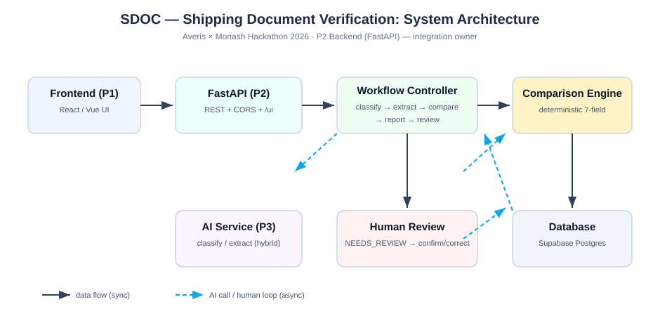

# SDOC Backend — Shipping Document Verification API

Averis × Monash Hackathon 2026 — **P2: Backend / API / Cloud / Integration**.

Inbox → classification → SI/BL extraction → **deterministic** 7-field comparison
→ discrepancy report → human-in-the-loop review → deployment.



```
Frontend (P1)  →  FastAPI (P2)  →  Workflow Controller  →  Comparison Engine (deterministic)
                       ↓                                        ↓  ↕  ↕
                  AI Service (P3, hybrid)                  Database ↔ Human Review
```

## Score (official local scorer, 520 emails)

**FINAL 1.0000** — Stage-1 macro-F1 1.000 · Stage-3 field-F1 1.000 ·
End-to-End **46/46**. Reliability axis is diagnostic only (not weighted).

The same 1.0000 holds after injecting six kinds of meaning-preserving noise
(see [Robustness](#robustness-noise-that-must-not-change-the-answer)) — that,
not the clean-bundle number, is the result that should transfer to the final
evaluation set.

## Quick start

```bash
cd backend
python -m venv .venv && .venv/Scripts/activate      # Windows
pip install -r requirements.txt
cp .env.example .env                                # set DATA_SOURCE
uvicorn app.main:app --reload --port 8000
# docs: http://localhost:8000/docs
# Windows shortcut: double-click start_backend.bat
```

> If pip cannot reach the default index:
> `pip install -r requirements.txt --index-url https://pypi.org/simple --trusted-host pypi.org --trusted-host files.pythonhosted.org`

## Verify it works (one command)

With the server running:

```bash
python scripts/smoke_test.py            # or: python scripts/smoke_test.py http://localhost:8000
```

It checks health → inbox load → process one known email → assert the
**expected** deterministic verdict (`email_004` must be `MISMATCH` on
`consignee` + `notify_party`) → report persistence → human review →
aggregates → submission shape. All 9 checks must PASS.

### Manual walkthrough / demo script

```bash
# 1. is it alive?
curl http://localhost:8000/health

# 2. one email end-to-end (~15 ms)
curl -X POST http://localhost:8000/emails/email_004/process

# 3. read the full report (per-field SI vs BL evidence)
curl http://localhost:8000/reports/email_004

# 4. run the whole inbox (520 emails, ~90 s)
curl -X POST "http://localhost:8000/emails/process-all"

# 5. what did we find?
curl http://localhost:8000/reports/summary/stats

# 6. human review a flagged case (closed loop — re-runs comparison)
curl -X POST http://localhost:8000/reviews/email_004 \
  -H "Content-Type: application/json" \
  -d '{"decision":"CORRECT","corrected_fields":{"consignee":"UAB NOVAKOPA"},"reviewer":"nicol"}'

# 7. browser: http://localhost:8000/docs  (click any endpoint → Try it out)
```

`.env` essentials:

| Variable | Meaning |
|---|---|
| `DATA_SOURCE` | Folder with `inbox/` + `attachments/` **or** `http://localhost:8080` |
| `DATABASE_URL` | `sqlite:///./sdoc.db` (dev) or Supabase Postgres URL (prod) |
| `AI_PROVIDER` | `rule` (offline, default) · `remote` (P3 service) · `hybrid` |
| `AI_SERVICE_URL` | P3's AI base URL, used when provider is `remote`/`hybrid` |

## API

| Method | Endpoint | Purpose |
|---|---|---|
| GET | `/health` | Liveness + config echo + counts |
| GET | `/emails?limit=&offset=` | Inbox listing with processing status |
| GET | `/emails/{email_id}` | One email (sender, subject, body, attachments) |
| POST | `/emails/{email_id}/process` | Run the pipeline (idempotent — re-run = retry) |
| POST | `/emails/process-all?limit=` | Process the whole inbox (520 emails, ~2 min) |
| POST | `/emails/retry-failed?statuses=ERROR&statuses=NEEDS_REVIEW` | Retry every email without a verdict |
| GET | `/emails/{email_id}/status` | `PENDING`/`PROCESSING`/`COMPLETED`/`NEEDS_HUMAN`/`FAILED` + stage + attempts + error text |
| GET | `/reports?status=&category=&has_defect=` | Filtered report list |
| GET | `/reports/{id_or_email_id}` | Full report with per-field evidence |
| GET | `/reports/summary/stats` | Aggregates: status/category/defect frequency |
| GET | `/reports/submission/json` | Self-evaluation payload (sample_submission shape) |
| POST | `/reviews/{email_id}` | Human decision: `CONFIRM` / `CORRECT` / `REJECT` |
| GET | `/reviews` · `/reviews/{email_id}` | Review history |
| GET | `/ui/` | Reference client — proves Frontend ↔ Backend |

Frozen contract: [`docs/API_CONTRACT.md`](docs/API_CONTRACT.md) ·
Freeze record: [`docs/MVP_FREEZE.md`](docs/MVP_FREEZE.md) ·
Architecture: [`docs/architecture.svg`](docs/architecture.svg)

### Post a review (closed loop)

```bash
curl -X POST http://localhost:8000/reviews/email_004 \
  -H "Content-Type: application/json" \
  -d '{"decision":"CORRECT","corrected_fields":{"consignee":"UAB NOVAKOPA"},"reviewer":"nicol"}'
```
`CORRECT` re-runs the **deterministic** comparison with the corrected values and
rewrites the report — exactly the "confirm or correct → update the report"
human-in-the-loop the brief asks for.

### Build a submission

```bash
curl http://localhost:8000/reports/submission/json \
  | python -c "import sys,json; d=json.load(sys.stdin); json.dump(d['submission'], open('submission.json','w'), indent=2)"
# with the official dataset server running:
python -c "from loader import Inbox; print(Inbox('http://localhost:8080').submit(json.load(open('submission.json'))))"
```

## Determinism — non-negotiable

`app/services/comparison.py` compares normalized values, never asks an LLM:

- `container_count`: parse `6 x 40'HC` → `6`
- `gross_weight_kg`: parse `131,058 KG` → `131058.0`
- ports: UN/LOCODE (`NANTONG, CHINA (CNNTG)`) decides; else normalized name
- names: uppercased, punctuation stripped, legal suffixes removed, address cut

`SI container_count = 3` vs `BL = 4` → `3 != 4` → **MISMATCH**. End of story.

## Messier-input robustness (advanced stage)

The extractor aligns fields by *meaning* via synonym label sets, not exact
headers — so `Load Port` ≡ `Port of Loading`, `Cnee` ≡ `Consignee`, and weight
strings like `22,000 kg` / `22000kgs` / `22.000 KG` all normalize the same.
This is what the advanced stage scores: recognising that two documents express
the same field differently, and telling a real discrepancy from a formatting
difference.

## Robustness — noise that must not change the answer

```bash
python scripts/stress_evaluate.py      # ~30 s, uses the official scorer
```

Injects six meaning-preserving perturbations into the 94 SI/BL text pairs and
re-scores each perturbed submission. No gold answers are read — only the
aggregate official score.

| perturbation | verdict changes | fields lost | score |
|---|---|---|---|
| random whitespace / tabs | 0 | 0 | 1.0 |
| non-breaking spaces (PDF artefact) | 0 | 0 | 1.0 |
| blank line between every line | 0 | 0 | 1.0 |
| ALL-CAPS document | 0 | 0 | 1.0 |
| whole document on one line | 10 | 0 | 1.0 |
| reworded field labels | 0 | 0 | 1.0 |

Four real bugs came out of this harness; none were visible on clean data —
whitespace-variant labels, weight glued to following text (21 577 kg → 21 kg),
a collapsed document losing six of seven fields, and `Notify Party/Intermediate
Consignee` being split as if it were two fields.

Known remaining limitation: when line breaks are lost entirely, company names
absorb the address line. SI and BL degrade symmetrically, so end-to-end is
unaffected.

## Reliability & human review (advanced stage)

- When a document is **unreadable**, a value is **missing**, the sender attached
  the **wrong document**, or the result is **uncertain**, the case is escalated to
  `NEEDS_REVIEW` **with the reason and the partial evidence** (which attachment is
  missing, what was extracted) — a person confirms or corrects it, and the report
  is updated.
- **Visible failures:** AI-service outages / timeouts are caught, surfaced as a
  clear status + error text, and retried with exponential backoff (never silent).
- `POST /emails/{id}/process` is idempotent — calling it again is the retry.
- **Review queue grouped by reason:** `GET /api/review-queue` buckets
  escalations by `review_reason`; the ops board at `/ops/` renders them.

### Finding the SI and BL among the attachments

Two tiers, strictly ordered. Tier 1 reads the naming convention this corpus
uses (`email_123_SI.pdf`). Tier 2 runs **only** when tier 1 left a gap, and reads
the names senders actually write: `Draft_BL_v2.pdf`,
`Shipping_Instruction_PO123.pdf`, `SI.xlsx`, `BL-102938.pdf`. A name is accepted
only when it names exactly one of the two types, never when it names both or
names neither, and tier 1 always wins.

Without tier 2 an unrecognised name is indistinguishable from an absent file, so
the reviewer is handed `missing_attachment`. That blames the sender for a file
that was attached, and the reason on an escalation is exactly what the
reliability axis measures. The corpus never exercises tier 2 (all 250
attachments follow the convention), so this is not a scoring fix. It is what
keeps the escalation reason honest on any other inbox.

### Scanned documents: OCR reads them, humans confirm them

Of the 58 non-txt documents, 8 (emails 511–515) have **no embedded text
layer** — they literally say `SCANNED COPY - NO TEXT LAYER`. Two are also
truncated, so nothing can recover those; the rest are read by OCR.

The PDF reader is an escalating ladder — each rung runs only when the previous
one recovers too few of the 7 compared fields:

| Rung | Reader | Handles |
|---|---|---|
| 1 | `pypdf` text layer | machine-generated PDFs (exact, fast) |
| 2 | `pdfplumber` tables/layout | PDFs whose content is a **table** (pypdf scrambles cell order) |
| 3 | `pypdfium2` + OCR | **scanned / image-only** PDFs |
| — | escalate `unreadable` | truncated / genuinely unrecoverable files |

**OCR output is not trusted blindly.** Transcription errors (`VALPARAISO` →
`VALPARAISQ`, `CHINA` → `CHIMA`) look exactly like real discrepancies. So any
document read by an OCR rung (`pdf-ocr`, `image-ocr`) that is missing a compared
field is escalated with the transcription attached as evidence, rather than
silently compared:

```
scanned PDF → pypdf yields nothing → OCR transcribes → fields incomplete
            → NEEDS_REVIEW (evidence: OCR text + which fields are unreadable)
```

The test is on the reader, not on the file type: the same incomplete
transcription must reach a human whether it came from a scanned PDF or a photo
of an SI.

Every reader is optional. If `pdfplumber` / the OCR engine are not installed
the ladder degrades to rung 1 and the document escalates as `unreadable` —
never a wrong answer.

Legacy `.doc` (Word 97-2003) is the one reader that cannot be exact: the file is
an OLE container mixing binary structures with text, so any reading of it is an
interpretation. Word stores that text as UTF-16LE, and decoding the stream as
latin-1 leaves a NUL between every character, which used to yield a document
that counted as readable with all seven fields empty. The reader now tries both
decodings, keeps whichever one the extractor can actually parse, and requires at
least 2 of the 7 fields as evidence before trusting it. Below that it returns
nothing and the case escalates as `unreadable`: a value invented out of binary
noise is indistinguishable from a real discrepancy.

Measured: `OCR_ENABLED=0` and `OCR_ENABLED=1` produce **identical output on all
520 emails**. Not just the same status and `defect_fields`: the same
`review_reason` too, with 0 emails differing in any of the three. The switch
buys time, not accuracy. 2.1 s versus 23.0 s for the corpus.

**One switch, obeyed by both readers.** `ocr_available()` is the only thing that
reads `OCR_ENABLED`, and it reads it live. Two bugs lived here: the PDF rung was
gated by an import-time snapshot of the settings (so a change after startup did
nothing), and the image path consulted no switch at all, transcribing images
with `OCR_ENABLED=0` set. The container said OCR off and ran OCR anyway.

**Resolution is a measured choice, not a default.** Rendering at 300 DPI costs
about 4 s more than 200 DPI, and 200 DPI loses 1 to 2 of the 7 compared fields on
4 of the 6 scanned PDFs while fragmenting the heading into
`SHIPPING INSTRUC TION`. The transcription is the evidence a human has to verify,
so the fields are worth more than the seconds. `_RENDER_DPI` stays at 300; see
`tests/test_ocr_controls.py` before lowering it.

**Where the time actually goes.** Rendering is not the cost. Of the OCR work
inside a full run, page rendering is about 1.4 s for 8 render calls, and ONNX
inference on the 6 scanned pages is the rest (measured at 20 to 30 s depending
on machine load). Engine construction was a third cost that should not have
existed: `RapidOCR()` was rebuilt on every call, 9 times per run at about 0.6 s
each. Caching the engine and renderer probes and building the engine lazily
(a corrupt PDF no longer loads models it cannot use) is what took the end-to-end
OCR premium from about 63 s to the 21 s measured above.

Inference is already the cheapest honest configuration. Concurrency does not
help: threads and processes measured 0.86x to 0.99x, because inference already
saturates the CPU. Page count is capped at 20, which costs nothing on a corpus
where nothing exceeds one page and bounds a pathological input.

### The attachment security gate

`POST /api/v1/analyze` and `POST /api/v1/ingest` are externally reachable, so
every attachment passes `services/security.py` before anything opens it. It
refuses executables and scripts (by extension), a dangerous label sitting
directly before a document extension (`Draft_BL.exe.pdf`), real PE/ELF/Mach-O
bodies regardless of name, and a `.pdf` or `.docx` whose container header does
not match its extension.

Two decisions there are deliberate:

* **There is no whitelist of legitimate extensions.** Refusing everything
  unusual turns an unsupported format into a security incident, while the
  reader ladder already escalates it honestly as `unreadable`. The gate refuses
  a file for what it *is*, not for being unfamiliar.
* **The size cap is enforced on the encoded payload**, before it is decoded.
  base64 expands three bytes into four characters, so the decoded size is known
  from the length alone; decoding first would spend the memory the cap exists to
  protect.

A quarantine verdict also means the payload is **not persisted**: `/ingest`
returns `persisted: false` instead of writing the bytes to `INGEST_DIR`.

The gate guards the external entry points only. The corpus pipeline
(`workflow.evaluate_email`) reads its own trusted dataset and is unaffected, so
a change here cannot move the score.

## Statuses

| Status | Meaning |
|---|---|
| `OK` | BL_COMPARISON, all 7 fields match |
| `MISMATCH` | ≥1 field differs → `has_defect`, `defect_fields` |
| `NEEDS_REVIEW` | `missing_attachment` · `unreadable` · `missing_value` · `wrong_doc_type` (with evidence) |
| `SKIPPED` | Not a comparison request — classification only |
| `ERROR` | Pipeline exception; message stored, re-`POST` to retry |

### Why the escalation reason is what it is

The four reasons answer four different questions, and the reviewer's next action
depends on getting the right one:

| reason | what it means | what the reviewer does |
|---|---|---|
| `missing_attachment` | the SI/BL pair is not in the email | ask the sender to attach it |
| `wrong_doc_type` | the file **names itself** as something else | ask the sender for the right document |
| `unreadable` | we could not read the file | escalate to OCR / a human transcription |
| `missing_value` | read fine, but a field is not in it | weigh the gap in the comparison |

`wrong_doc_type` rests on a **self-declaration read from the heading**, so a
document is only called the wrong type when it says so. Five corpus emails
qualify: two carry a `PACKING LIST` in the BL slot, two a `CERTIFICATE OF
ORIGIN`, one a `COMMERCIAL INVOICE`, and the escalation now names the file for
the reviewer.

Two corpus facts shaped that rule. Ten PDFs are titled `BILL OF LADING
INSTRUCTION` and sit in the **SI** slot: they are shipping instructions, so the
instruction forms are matched before the plain ones, or a naive
"mentions BILL OF LADING" test would call all ten the wrong type. And 15
documents carry no heading at all (spreadsheet exports), so a silent heading is
not a finding and those are still compared on their fields.

The rule used to read `not res.fields or (...)`, which filed a PDF nobody could
open under the same reason as a packing list sent in place of a bill of lading.
Those two need opposite follow-up, and ground truth separates them: the
unopenable ones are `unreadable`. Measured after the change: `review_reason`
agrees with ground truth on **20/20** escalated emails (was 14/20), with
`defect_fields` still exact on 520/520.

## Layout

```
backend/
├── app/
│   ├── main.py              # FastAPI app, CORS, startup, /health, /ui
│   ├── config.py            # env-driven settings
│   ├── database.py          # engine + session (SQLite/Postgres)
│   ├── models.py            # emails / reports / reviews tables
│   ├── schemas.py           # Pydantic contract for P1 + P3
│   ├── routers/             # emails.py · reports.py · reviews.py · ingest.py (external API)
│   └── services/
│       ├── loader.py        # official dataset loader (verbatim)
│       ├── inbox_service.py # cached inbox access
│       ├── classifier.py    # rule-based email categories
│       ├── extractor.py     # label-synonym field extraction (robust)
│       ├── comparison.py    # deterministic 7-field comparison
│       ├── ai_service.py    # P3 integration (rule / remote / hybrid + backoff)
│       ├── security.py      # attachment gate for the external entry points
│       ├── ocr.py           # optional OCR fallback (switch, DPI, page cap)
│       ├── versioning.py    # document versions per shipment
│       └── workflow.py      # orchestration + persistence + review
├── docs/                   # API_CONTRACT · MVP_FREEZE · architecture.svg
├── Dockerfile · docker-compose.yml · requirements.txt · .env.example
```

## Regression gates — run before every push

```bash
python -m pytest tests -q          # 108 unit/integration tests (no server needed)
python scripts/tune_eval.py        # score with the official scorer (expect 1.0000)
python scripts/stress_evaluate.py  # score under 6 noise perturbations (expect 1.0)
python scripts/smoke_test.py       # 9 E2E checks against the live API
python scripts/check_secrets.py    # nothing sensitive about to be committed
```

`tests/conftest.py` gives every test a throwaway in-memory database and a
temporary ingest directory, so running the suite never writes to `sdoc.db` or
`data/ingested/`. `pytest.ini` pins collection to `tests/`, so a bare `pytest`
is safe as well: `scripts/smoke_test.py` matches pytest's `*_test.py` pattern
but is a live-server script, not a unit test. Keep new tests inside `tests/`,
since that is the only directory the harness covers.

## Scoring / tuning loop (no Docker required)

`scripts/tune_eval.py` runs the full pipeline in-process and grades it with the
organisers' `score_cli.py` — the local equivalent of `POST /submit`. ~10 s for
all 520 emails, so tune against the real metric instead of guessing.

```bash
python scripts/tune_eval.py                    # prints the official scoreboard
python scripts/tune_eval.py --limit 40         # quick pipeline check (do not read its score)
```

Tuning log and open questions: [`docs/MVP_FREEZE.md`](docs/MVP_FREEZE.md).

### Where the scorer and the ground truth live

Both ship only inside the organisers' Docker bundle, so they are not in this
repo. `scripts/sdoc_paths.py` looks for them in a few conventional places
(upward from `backend/`, then `~/Downloads/sdoc-hackathon-docker`), and scripts
ask that module instead of hardcoding a path of their own. If yours sits
somewhere else, say so once and every script picks it up:

```bash
export SDOC_MATERIALS=/path/to/sdoc-hackathon-docker
```

Or override per run with `--scorer <path>`. Passing `--ground-truth` is
normally unnecessary: `score_cli.py` reads `data_v2/ground_truth.json` from its
own folder, and leaving it out is what guarantees the scorer and the answer key
cannot come from two different bundles.

## Diagnostics: measure a rule before changing it

Comparison rules are easy to argue about and impossible to settle by intuition,
so each open question got a measuring script instead of an opinion. All of them
only read; none of them touches source files or the database.

```bash
python scripts/diag_reliability.py     # escalation precision/recall + every false flag listed
python scripts/diag_port_locode.py     # how often one document prints a UN/LOCODE and the other does not
python scripts/diag_port_lenient.py    # A/B both port rules through the official scorer (~2 min, runs the inbox twice)
python scripts/diag_filename_fallback.py  # tier-2 naming: corpus diff + the names that must and must not resolve
```

One maintenance script is not a diagnostic, and it deletes rows, so it is dry
run by default:

```bash
python scripts/clean_ingest_pollution.py           # show what it would remove
python scripts/clean_ingest_pollution.py --apply   # remove it, after backing it up
```

It exists because `scripts/test_ingest_api.py` used to write to the real
database and the real ingest directory when a bare `pytest` collected it. That
file now lives in `tests/` under the isolation harness, so this cleans up the
one leftover row and folder rather than guarding against a live hazard. Both the
database and the folder are copied to `backend/cleanup-backup-<stamp>/` and the
copy is verified before anything is deleted.

`diag_port_lenient.py` doubles as the template for any "should we relax rule X?"
question: patch in the alternative predicate, score both variants with the real
scorer, keep whichever wins. It restores the original function in a `finally`
block, so the measured change never leaks into the working tree. This is how the
decision to keep the strict name+LOCODE comparison was made, and it is why that
rule is still the shipped one.

`diag_filename_fallback.py` is the counterpart for "did this change anything?"
questions: it runs the new code and the old code over the whole corpus and
prints the difference, which is the fastest way to show that a fallback path
never fires where it should not.

## P3 (AI) contract

Set `AI_PROVIDER=hybrid` and point `AI_SERVICE_URL` at P3:

```
POST {AI}/classify   {"email": {...}}                     -> {"category": "...", "confidence": 0.9}
POST {AI}/extract    {"doc_type":"SI","filename":"...","content_base64":"..."}
                     -> {"fields": {7 keys}, "readable": true}
```

Before P3 exists, run the simulator to prove the wiring end to end:

```bash
python scripts/mock_ai_service.py --port 8001      # terminal 1
AI_PROVIDER=hybrid AI_SERVICE_URL=http://127.0.0.1:8001 uvicorn app.main:app  # terminal 2
```

Hybrid guarantees no regression: if the AI service is down **or** returns
unreadable/incomplete fields for a PDF/Word/Excel file, the local parser
backfills, so the hybrid path is never worse than the rule path.

## Deployment (Phase 5)

1. Supabase Postgres → set `DATABASE_URL`, redeploy (tables auto-create).
2. Render: **New Web Service** → Docker → port `8000`; env vars from above.
3. Vercel: frontend only; set `VITE_API_BASE` to the Render URL.
4. `CORS_ORIGINS` on the backend must include the Vercel origin.
5. Never commit `.env`; verify no API keys in git before submission.
